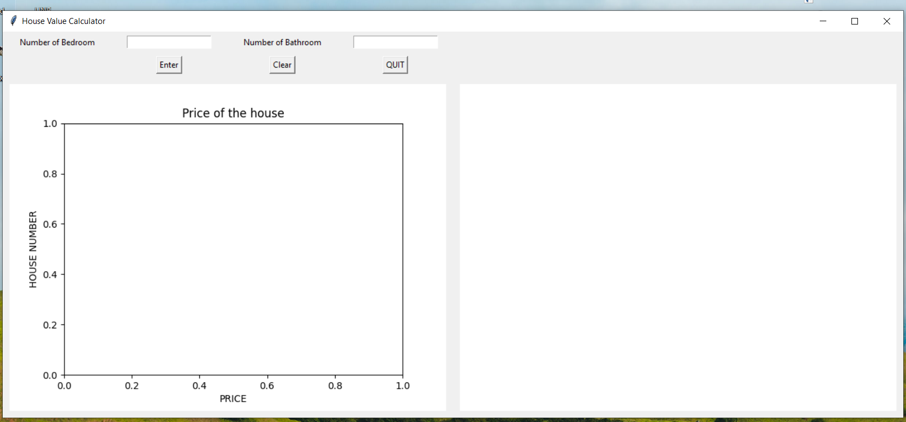
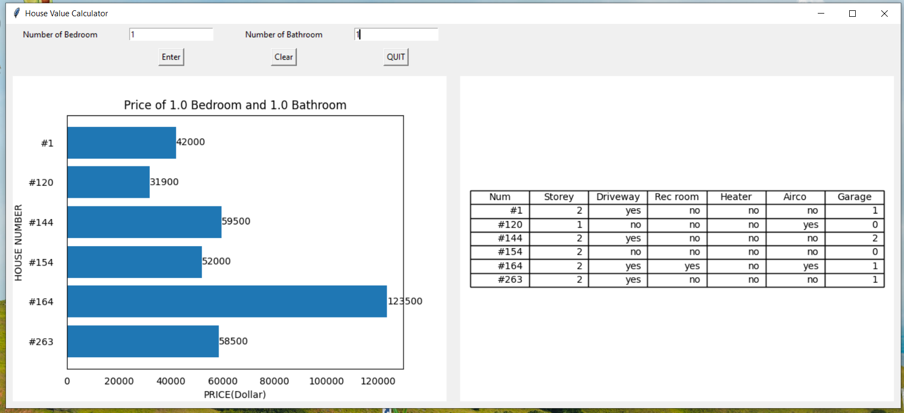
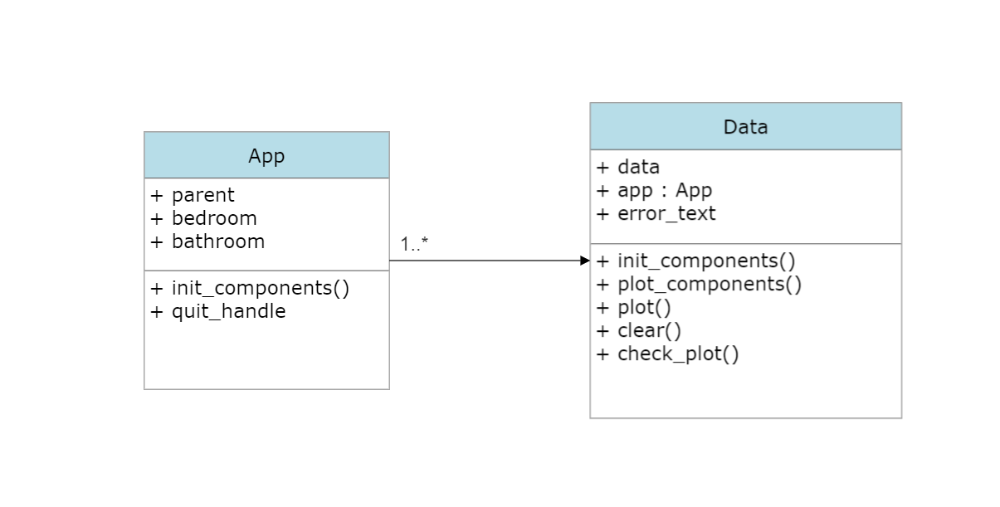

# Your Application Name
 
## Description
This program helps users to know the prices of houses that they are interested in.

User have to enter the number of bedrooms and bathrooms.
The program will calculate the price of each house and compare them.
Then program will show the result by 1 bar graph and 1 table.
Bar graph use to show the price between each house and 
table graph use to show detail of each house.

For example User looking for a price of the house 1 bedrooms and 1 bathrooms.
The program will show a price of house#1, #120,#144,#154,#164 qnd #263.(They all have 1bedrooms and 1 bathroom 
but different price because some of them have no driveway some no rec room) and show the detail of each house in the table on the right-hand side.

**Video link**: https://youtu.be/rMORTTEi4Aw
 
## Running the Application
You have to installed pandas, tkinter, matplotlib and import time. You can run it on the file that name [`main.py`](main.py)
 
## Design

- class [`App`](final_project_2.py) use to create the widgets and crate some button
- class [`Data`](final_project_2.py) use to calculate data and show plotting graph
 
## Design Patterns Used
- Observer Pattern when object(number of bedroom and bathroom) changes value, all its dependents are notified and updated automatically.
- Composite Pattern Define a class for the basic behavior of all components. Define a Composite as a subclass that implements this behavior.

## Other Information
I just realized that we can create a simple table from matplotlib. Before that I was trying to create a table from tkinter and it was very tricky.